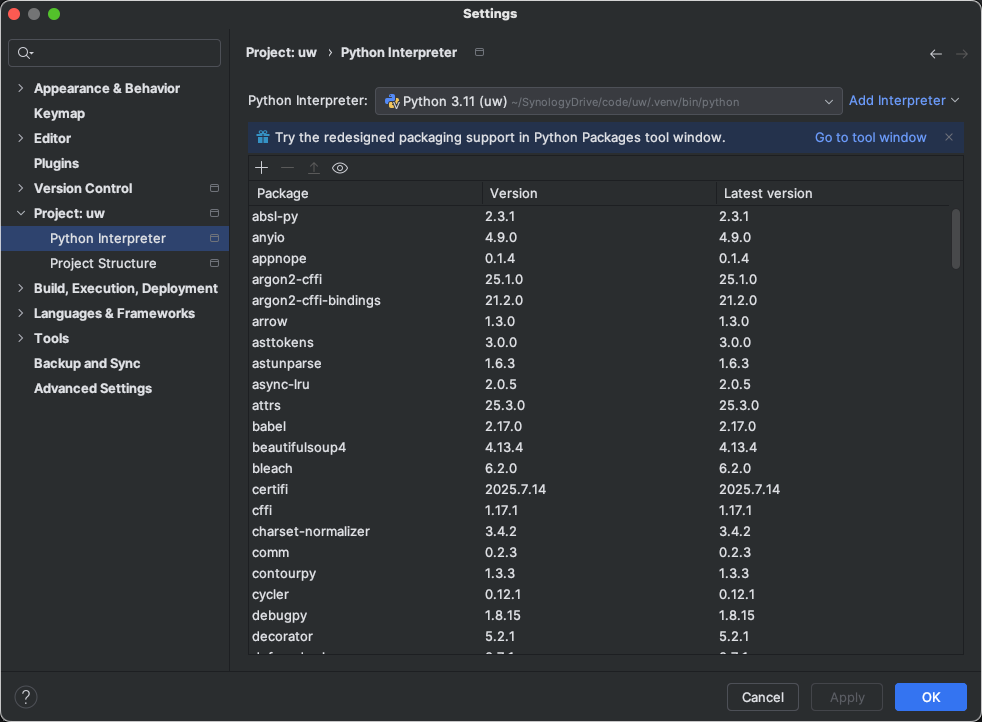

# uw
Mega repo with all UW classes.<p>
As of Aug 2025, using Python 3.11 venv.<p>

## Package Installation
Use PyCharm UI<p>


## Convert Jupyter Notebooks to PDF
```bash
 jupyter nbconvert --to=pdf Lab4-18_Neural_Networks_SGonzales_v2.ipynb
```